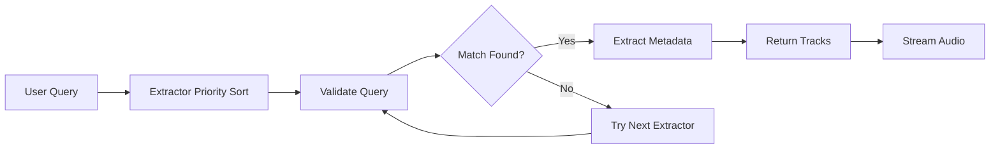

## What are Extractors?

Extractors are modular components in Discord Player that handle fetching metadata and streaming audio from various sources. Each extractor is responsible for:

- **Validating queries** - Determining if a query belongs to their service
- **Extracting metadata** - Fetching track information (title, author, duration, etc.)
- **Streaming audio** - Providing playable audio streams
- **Bridging** - Converting metadata from one source to a streamable format from another

<Info>
Extractors use a priority system where higher priority extractors are executed first. The default priority is `1`, but you can customize it when creating custom extractors.
</Info>

## How Extractors Work

### Execution Flow

When you search for a track, Discord Player:

1. **Runs all registered extractors** sorted by priority (highest first)
2. **Validates the query** against each extractor using `validate()`
3. **Handles the query** with the first matching extractor using `handle()`
4. **Returns track metadata** as `Track` objects
5. **Streams audio** when needed using `stream()`



### Bridging System

Some extractors (like Spotify and Apple Music) only provide metadata, not audio streams. Discord Player uses a **bridging system** to automatically find streamable versions:

```typescript
// Spotify extractor returns metadata only
const spotifyTrack = await player.search('https://open.spotify.com/track/...');

// When streaming, Discord Player automatically bridges to another extractor
// For example, it might search YouTube or SoundCloud for the same song
```

Extractors that support bridging implement the `bridge()` method:

```typescript /bridge/
public async bridge(
  track: Track,
  sourceExtractor: BaseExtractor | null,
): Promise<ExtractorStreamable | null> {
  // Search for the track on this extractor's platform
  const query = sourceExtractor?.createBridgeQuery(track) ?? 
    `${track.author} - ${track.title}`;
  
  const result = await this.handle(query, { type: QueryType.SEARCH });
  
  if (!result.tracks.length) return null;
  
  return this.stream(result.tracks[0]);
}
```

## Loading Extractors

### Load Default Extractors

```typescript
import { Player } from 'discord-player';
import { DefaultExtractors } from '@discord-player/extractor';

const player = new Player(client);

// Load all default extractors
await player.extractors.loadMulti(DefaultExtractors);
```

### Load Specific Extractors

```typescript
import { SpotifyExtractor, SoundCloudExtractor } from '@discord-player/extractor';

// Load only Spotify and SoundCloud
await player.extractors.loadMulti([
  SpotifyExtractor,
  SoundCloudExtractor
]);
```

### Load with Options

```typescript
await player.extractors.loadMulti(
  [SpotifyExtractor, SoundCloudExtractor],
  {
    'com.discord-player.spotifyextractor': {
      clientId: 'your-client-id',
      clientSecret: 'your-client-secret'
    },
    'com.discord-player.soundcloudextractor': {
      clientId: 'your-soundcloud-client-id'
    }
  }
);
```

## Managing Extractors

### Register Individual Extractor

```typescript
import { SpotifyExtractor } from '@discord-player/extractor';

const extractor = await player.extractors.register(
  SpotifyExtractor,
  {
    clientId: 'your-client-id',
    clientSecret: 'your-client-secret'
  }
);
```

### Unregister Extractor

```typescript
// By identifier
await player.extractors.unregister('com.discord-player.spotifyextractor');

// By instance
await player.extractors.unregister(extractor);
```

### Check Extractor Status

```typescript
// Check if registered
if (player.extractors.isRegistered('com.discord-player.spotifyextractor')) {
  console.log('Spotify extractor is registered');
}

// Get extractor instance
const spotify = player.extractors.get('com.discord-player.spotifyextractor');

// Check if enabled/disabled
if (player.extractors.isEnabled('com.discord-player.spotifyextractor')) {
  console.log('Spotify extractor is enabled');
}

// Get count of registered extractors
console.log(`${player.extractors.size} extractors registered`);
```

### Block Extractors

You can prevent specific extractors from executing:

```typescript
const player = new Player(client, {
  blockExtractors: [
    'com.discord-player.spotifyextractor',
    'com.discord-player.applemusicextractor'
  ]
});
```

## Extractor Events

Listen to extractor lifecycle events:

```typescript
// Extractor registered
player.extractors.on('registered', (context, extractor) => {
  console.log(`Registered: ${extractor.identifier}`);
});

// Extractor activated
player.extractors.on('activate', (context, extractor) => {
  console.log(`Activated: ${extractor.identifier}`);
});

// Extractor deactivated
player.extractors.on('deactivate', (context, extractor) => {
  console.log(`Deactivated: ${extractor.identifier}`);
});

// Extractor unregistered
player.extractors.on('unregistered', (context, extractor) => {
  console.log(`Unregistered: ${extractor.identifier}`);
});

// Extractor error
player.extractors.on('error', (context, extractor, error) => {
  console.error(`Error in ${extractor.identifier}:`, error);
});
```

## Protocols

Extractors can define custom protocols for search shortcuts:

```typescript
// SoundCloud: scsearch
await player.search('scsearch:alan walker faded');

// Spotify: spsearch
await player.search('spsearch:imagine dragons');

// Apple Music: amsearch
await player.search('amsearch:taylor swift');
```

<Note>
Protocols are defined in each extractor's `protocols` property and are automatically registered during activation.
</Note>

## Query Types

Discord Player uses query types to route queries to the appropriate extractor:

| Query Type | Description | Example |
|------------|-------------|--------|
| `SPOTIFY_SONG` | Spotify track | `https://open.spotify.com/track/...` |
| `SPOTIFY_PLAYLIST` | Spotify playlist | `https://open.spotify.com/playlist/...` |
| `SPOTIFY_ALBUM` | Spotify album | `https://open.spotify.com/album/...` |
| `SPOTIFY_SEARCH` | Spotify search | `spsearch:query` |
| `SOUNDCLOUD_TRACK` | SoundCloud track | `https://soundcloud.com/...` |
| `SOUNDCLOUD_PLAYLIST` | SoundCloud playlist | SoundCloud set URL |
| `SOUNDCLOUD_SEARCH` | SoundCloud search | `scsearch:query` |
| `APPLE_MUSIC_SONG` | Apple Music song | `https://music.apple.com/...` |
| `APPLE_MUSIC_ALBUM` | Apple Music album | Apple Music album URL |
| `APPLE_MUSIC_PLAYLIST` | Apple Music playlist | Apple Music playlist URL |
| `VIMEO` | Vimeo video | `https://vimeo.com/...` |
| `REVERBNATION` | Reverbnation track | `https://reverbnation.com/...` |
| `ARBITRARY` | Direct URL | Any direct audio URL |
| `FILE` | Local file | `/path/to/file.mp3` |
| `AUTO` | Auto-detect | Let Discord Player detect |

## Best Practices

<Card title="Load extractors once" icon="circle-check">
Load extractors during bot initialization, not on every command.
</Card>

<Card title="Use loadMulti for batches" icon="circle-check">
Use `loadMulti()` instead of multiple `register()` calls for better performance.
</Card>

<Card title="Handle extractor errors" icon="circle-check">
Listen to the `error` event to catch and log extractor failures.
</Card>

<Card title="Set appropriate priorities" icon="circle-check">
Custom extractors should have priorities based on their reliability and speed.
</Card>

## Next Steps

<CardGroup cols={2}>
  <Card title="Default Extractors" icon="box" href="/extractors/default-extractors">
    Learn about built-in extractors and their configuration
  </Card>
  <Card title="Custom Extractors" icon="code" href="/extractors/custom-extractors">
    Create your own extractors for custom sources
  </Card>
</CardGroup>