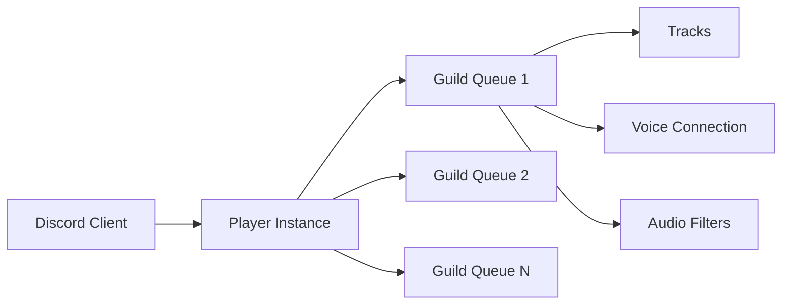

# Welcome to Discord Player

Discord Player is a robust framework for developing Discord Music bots using JavaScript and TypeScript. It is built on top of the [discord-voip](https://npm.im/discord-voip) library and offers a comprehensive set of customizable tools, making it one of the most feature enrich framework in town.

## Why Choose Discord Player?

<CardGroup cols={2}>
  <Card title="Beginner Friendly" icon="graduation-cap">
    Easy-to-understand features with a quick and easy setup process. Perfect for developers of all skill levels.
  </Card>
  
  <Card title="TypeScript Support" icon="code">
    Full TypeScript support with comprehensive type definitions for a better development experience.
  </Card>
  
  <Card title="Extensible Sources" icon="puzzle-piece">
    Support for multiple audio sources through the Extractors API. Add custom extractors to support any platform.
  </Card>
  
  <Card title="Automatic Queue Management" icon="list">
    Built-in queue management with automatic handling of tracks, playlists, and playback controls.
  </Card>
  
  <Card title="64+ Audio Filters" icon="sliders">
    Offers 64+ built-in audio filter presets including nightcore, vaporwave, bass boost, and more.
  </Card>
  
  <Card title="Built-in Stats Tracker" icon="chart-line">
    Track playback statistics, event loop latency, and queue performance with built-in monitoring tools.
  </Card>
</CardGroup>

## Key Features

- **Hackable APIs** - Highly customizable according to your needs with object-oriented design
- **Audio Player Sharing** - Share audio players across multiple guilds for efficient resource usage
- **Query Caching** - Cache search results to reduce API calls and improve performance
- **Voice States Handling** - Out-of-the-box voice state event handling for automatic reconnection
- **IP Rotation Support** - Built-in support for IP rotation to avoid rate limits
- **Serialization** - Easy serialization and deserialization for queue persistence
- **Eris Support** - Experimental support for [Eris](https://npmjs.com/eris) client
- **Debug Methods** - Comprehensive debugging tools to troubleshoot issues quickly

## How It Works

Discord Player works by creating a main `Player` instance that handles and keeps track of all queues and their components. Each guild gets its own `GuildQueue` instance that manages the playback for that specific server.

## Architecture

The framework is built around several core components:

- **Player** - The main entry point that manages all guild queues
- **GuildQueue** - Manages playback for a specific guild
- **Track** - Represents an audio track with metadata
- **Extractors** - Handle fetching audio data from various sources
- **StreamDispatcher** - Manages audio streaming and playback
- **AudioFilters** - Apply real-time audio effects and filters

<Info>
  Discord Player is event-based. It emits different events based on the context and actions, making it easy to build interactive music bots.
</Info>

## Requirements

Before you start, ensure you have:

- **Node.js** v16.9.0 or higher
- **Discord.js** v14.0 or higher
- **FFmpeg** or Avconv installed on your system
- An **opus library** (we recommend mediaplex)

<Warning>
  Make sure you have the `GuildVoiceStates` intent enabled in your Discord client configuration. Without this intent, Discord Player won't be able to handle voice connections properly.
</Warning>

## Getting Started

Ready to build your music bot? Follow our guides:

<CardGroup cols={2}>
  <Card title="Installation" icon="download" href="/installation">
    Install Discord Player and all required dependencies
  </Card>
  
  <Card title="Quick Start" icon="rocket" href="/quickstart">
    Build your first music bot in minutes
  </Card>
  
  <Card title="Core Concepts" icon="book" href="/core/player">
    Learn about the core concepts and architecture
  </Card>
  
  <Card title="Extractors" icon="puzzle-piece" href="/extractors/overview">
    Learn about audio source extractors
  </Card>
</CardGroup>

## Community

Join our community to get help, share your bots, and contribute:

- **Discord Server** - Get support and chat with other developers
- **GitHub** - Report issues, request features, or contribute
- **Showcase** - Explore community-built bots and extractors at [discord-player.js.org/showcase](https://discord-player.js.org/showcase)

## Version

This documentation is for Discord Player v7.2.0. Make sure your installed version matches this documentation for the best experience.